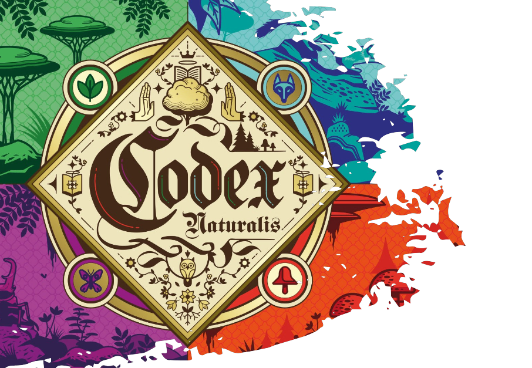

## Index
- [Codex Naturalis](#Codex-Naturalis)
- [Features](#Features)
- [Documentation](#Documentation)
- [System Requirements](#System-Requirements)
- [Execution](#Execution)

## Codex Naturalis
The project involves the software implementation of the board game [Codex Naturalis](https://www.craniocreations.it/prodotto/codex-naturalis). The game is designed for 2 to 4 players, so we developed a distributed application following the MVC pattern, with a server that allows multiple clients to play the same game simultaneously. Additionally, we decided to offer users two different ways to interact with the application, both in terms of network and visual interface.

## Features
In accordance with the project requirements, we developed the following features:
- **Complete Rules**
- **TUI** (Text User Interface)
- **GUI** (Graphical User Interface)
- **RMI** (Remote Method Invocation)
- **Socket**

Additionally, we chose to implement the following two extra features:
- **Multiple Games**: The server is designed to handle multiple games simultaneously. This allows players to choose which open and not-yet-started game to join or to create a new game upon entry.
- **Chat**: The client and server offer players the ability to chat with each other during a game, sending text messages to all players in the game or to a single player.

## Documentation
### UML
- [High level UML](deliverables/UML/UML_Project.pdf)
- [Detailed UML](deliverables/UML/detailed)

### JavaDOC 
The following documentation includes a description for most of the classes and methods used, it follows Java documentation techniques 
and can be consulted [here](deliverables/javadoc).


## Execution
### Starting the Server
To start the server, type the following command in a terminal:
```sh
java -jar Server.jar 
```
The server will start with the default values:
- 1337 for socket;
- 1099 for RMI.

### Starting the Client
To start the client, type the following command in a terminal:
```sh
java -jar Client.jar 
```

## System Requirements

This program requires Java 21 or higher to run correctly.

### For the CLI Interface:
#### For Emoji visualization in Windows Powershell:
- Press `Win+R`
- Type `intl.cpl` (which opens the regional settings)
- Activate the "Administrative" tab
- Click on "Change system locale..."
- Check "Beta: Use Unicode UTF-8 for worldwide language support" 
- [Clicke here for more information](https://stackoverflow.com/questions/57131654/using-utf-8-encoding-chcp-65001-in-command-prompt-windows-powershell-window)

#### Displaying the grid
If the grid is too large, for a correct rendering:
- for macOS, command + - until the rendering is ok
- for Windows, ctrl + - and then re-print the grid. If the grid is still not correctly displayed repeat the process.
### For the GUI Interface:
- A screen with a resolution higher than 1440x900 px.


### Authors
- Spandri Michelangelo
- Spazzadeschi Beatrice
- Valentini Jacopo
- Zanoni Alessandro